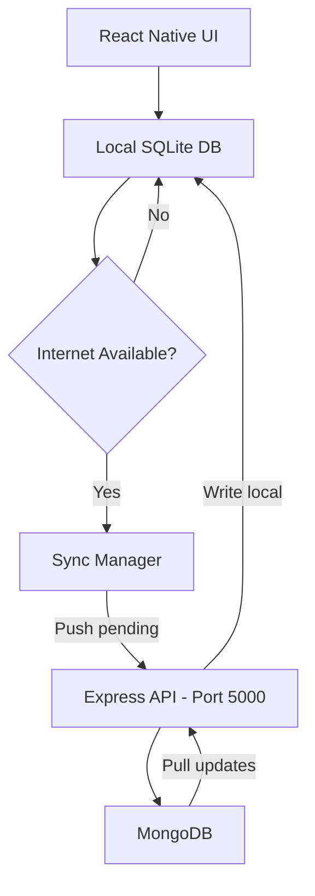

# 🔄 Offline-First Synchronization — Implementation Guide

> **This document describes the actual sync implementation between the React Native mobile app (SQLite + Drizzle) and the Express + MongoDB backend.**

---

## 📂 Architecture



**Offline:** Everything saves to SQLite with `sync_status = 'pending'`. App works fully offline.
**Online:** Sync manager pushes pending items to MongoDB and pulls remote updates back.

---

## ⚠️ Field Mapping (Important)

The MongoDB schemas only store a subset of fields. Mobile-only fields stay in SQLite and do **NOT** sync.

### Expense Fields
| Field | SQLite (Mobile) | MongoDB (Server) | Syncs? |
|-------|----------------|-------------------|--------|
| title | ✅ | ✅ | ✅ |
| amount | ✅ | ✅ | ✅ |
| month | ✅ | ✅ | ✅ |
| method | ✅ | ✅ | ✅ |
| category | ✅ | ❌ | ❌ Local only |
| date | ✅ | ❌ | ❌ Local only |
| description | ✅ | ❌ | ❌ Local only |
| remote_id | ✅ | — | Tracks MongoDB `_id` |
| sync_status | ✅ | — | `'pending'` or `'synced'` |

### Budget Fields
| Field | SQLite (Mobile) | MongoDB (Server) | Syncs? |
|-------|----------------|-------------------|--------|
| amount | ✅ | ✅ | ✅ |
| month | ✅ | ✅ | ✅ |
| remote_id | ✅ | — | Tracks MongoDB `_id` |
| sync_status | ✅ | — | `'pending'` or `'synced'` |

### Fuel Log Fields
| Field | SQLite (Mobile) | MongoDB (Server) | Syncs? |
|-------|----------------|-------------------|--------|
| startKm | ✅ | ✅ | ✅ |
| odometerKm | ✅ | ✅ | ✅ (nullable) |
| litres | ✅ | ✅ | ✅ |
| pricePerLitre | ✅ | ✅ | ✅ |
| totalCost | ✅ | ✅ | ✅ |
| date | ✅ | ✅ | ✅ |
| month | ✅ | ✅ | ✅ |
| note | ✅ | ✅ | ✅ |
| remote_id | ✅ | — | Tracks MongoDB `_id` |
| sync_status | ✅ | — | `'pending'` or `'synced'` |

> **Note:** All fuel fields sync to MongoDB (unlike expenses where category/date/description are local-only).

---

## 🗄️ MongoDB Schemas (Unchanged)

### `Backend/Models/expense.js`
```javascript
const ExpenseSchema = new mongoose.Schema(
  {
    title: { type: String, required: true },
    amount: { type: Number, required: true },
    month: { type: String, required: true },
    method: { type: String, required: true },
  },
  { timestamps: true }  // Gives us updatedAt for delta sync
);
```

### `Backend/Models/budget.js`
```javascript
const BudgetSchema = new mongoose.Schema({
  month: { type: String, required: true, unique: true },
  amount: { type: Number, required: true },
});
// ⚠️ No timestamps — delta sync does full pull for budgets
```

### `Backend/Models/fuelLog.js`
```javascript
const FuelLogSchema = new mongoose.Schema(
  {
    startKm: { type: Number, required: true },
    odometerKm: { type: Number, default: null },   // nullable — end reading added later
    litres: { type: Number, required: true },
    pricePerLitre: { type: Number, required: true },
    totalCost: { type: Number, required: true },
    date: { type: String, required: true },
    month: { type: String, required: true },
    note: { type: String, default: "" },
  },
  { timestamps: true }  // Gives us updatedAt for delta sync
);
```

---

## 🛤️ Backend Sync API Endpoints

### Expense Sync (`Backend/Routes/expense.routes.js`)

**`POST /expenses/sync`** — Push pending mobile expenses to MongoDB
```javascript
// Request body:
{ expenses: [{ id, remoteId, title, amount, month, method }] }

// Response:
{ success: true, syncedIds: [{ localId, remoteId }] }
```

**`GET /expenses/delta?since=<timestamp>`** — Pull expenses updated since last sync
```javascript
// Response:
{ items: [{ _id, title, amount, month, method }], timestamp: 1716345600000 }
```

### Budget Sync (`Backend/Routes/budget.routes.js`)

**`POST /budget/sync`** — Push pending mobile budgets to MongoDB
```javascript
// Request body:
{ budgets: [{ id, remoteId, amount, month }] }

// Response:
{ success: true, syncedIds: [{ localId, remoteId }] }
```

**`GET /budget/delta`** — Pull ALL budgets (no timestamps = full pull each time)
```javascript
// Response:
{ items: [{ _id, amount, month }], timestamp: 1716345600000 }
```

### Fuel Log Sync (`Backend/Routes/fuel.routes.js`)

**`POST /fuel/sync`** — Push pending mobile fuel logs to MongoDB
```javascript
// Request body:
{ fuelLogs: [{ id, remoteId, startKm, odometerKm, litres, pricePerLitre, totalCost, date, month, note }] }

// Response:
{ success: true, syncedIds: [{ localId, remoteId }] }
```

**`GET /fuel/delta?since=<timestamp>`** — Pull fuel logs updated since last sync
```javascript
// Response:
{ items: [{ _id, startKm, odometerKm, litres, pricePerLitre, totalCost, date, month, note }], timestamp: 1716345600000, activeIds: ["..."] }
```

---

## 📱 Mobile SQLite Schema (`src/lib/db/schema.js`)

```javascript
export const expenses = sqliteTable('expenses', {
  id: integer('id').primaryKey({ autoIncrement: true }),
  remoteId: text('remote_id'),           // MongoDB _id
  title: text('title').notNull(),
  amount: real('amount').notNull(),
  category: text('category'),            // Local only — NOT in MongoDB
  date: text('date'),                    // Local only — NOT in MongoDB
  description: text('description'),      // Local only — NOT in MongoDB
  month: text('month').notNull(),
  method: text('method'),
  syncStatus: text('sync_status').default('pending'),
  createdAt: text('created_at').default(sql`CURRENT_TIMESTAMP`),
});

export const budgets = sqliteTable('budgets', {
  id: integer('id').primaryKey({ autoIncrement: true }),
  remoteId: text('remote_id'),           // MongoDB _id
  amount: real('amount').notNull(),
  month: text('month').notNull().unique(),
  syncStatus: text('sync_status').default('pending'),
  createdAt: text('created_at').default(sql`CURRENT_TIMESTAMP`),
});

export const fuelLogs = sqliteTable('fuel_logs', {
  id: integer('id').primaryKey({ autoIncrement: true }),
  remoteId: text('remote_id'),           // MongoDB _id
  startKm: real('start_km').notNull(),
  odometerKm: real('odometer_km'),       // nullable — end reading added later
  litres: real('litres').notNull(),
  pricePerLitre: real('price_per_litre').notNull(),
  totalCost: real('total_cost').notNull(),
  date: text('date').notNull(),
  month: text('month').notNull(),
  note: text('note'),
  syncStatus: text('sync_status').default('pending'),
  createdAt: text('created_at').default(sql`CURRENT_TIMESTAMP`),
});
```

---

## 🔄 Mobile Sync Manager (`src/lib/sync/syncManager.js`)

Three exported functions:

### `syncExpenses()`
1. **Push:** Queries SQLite for `sync_status = 'pending'` expenses
2. Sends only `{ id, remoteId, title, amount, month, method }` to `POST /expenses/sync`
3. Server upserts into MongoDB and returns `syncedIds` with MongoDB `_id`
4. Updates local SQLite: sets `sync_status = 'synced'` and stores `remote_id`
5. **Pull:** Fetches `GET /expenses/delta?since=<lastSync>` for new server records
6. Upserts into SQLite with `sync_status = 'synced'`

### `syncBudgets()`
1. **Push:** Same pattern as expenses but for budgets
2. Sends `{ id, remoteId, amount, month }` to `POST /budget/sync`
3. **Pull:** Fetches `GET /budget/delta` — pulls ALL budgets (no timestamps on model)
4. Upserts by `month` uniqueness

### `syncFuelLogs()`
1. **Push:** Queries SQLite for `sync_status = 'pending'` fuel logs
2. Sends all fuel fields to `POST /fuel/sync`
3. Server upserts into MongoDB and returns `syncedIds` with MongoDB `_id`
4. Updates local SQLite: sets `sync_status = 'synced'` and stores `remote_id`
5. **Pull:** Fetches `GET /fuel/delta?since=<lastSync>` for new/updated server records
6. Upserts into SQLite with `sync_status = 'synced'`
7. **Deletion reconciliation:** Removes local synced records whose `remoteId` is no longer in `activeIds`

### `syncAll()`
```javascript
export const syncAll = async () => {
  await syncExpenses();
  await syncBudgets();
  await syncFuelLogs();
};
```

---

## 🛰️ Auto-Sync Setup

To automatically trigger sync when the device comes online, install NetInfo and add a listener in your root layout:

```bash
npx expo install @react-native-community/netinfo
```

```javascript
// In src/app/_layout.jsx
import NetInfo from '@react-native-community/netinfo';
import { useEffect } from 'react';
import { syncAll } from '../lib/sync/syncManager';

// Inside your layout component:
useEffect(() => {
  const unsubscribe = NetInfo.addEventListener(state => {
    if (state.isConnected && state.isInternetReachable) {
      syncAll();
    }
  });
  return () => unsubscribe();
}, []);
```

---

## 🤖 Instructions for AI Coding Assistants

When you receive this file:
1. **DO NOT** modify the MongoDB Mongoose schemas — they are the source of truth
2. **Modify the mobile SQLite schema** to include `remoteId` and `syncStatus` columns
3. **Create `src/lib/sync/syncManager.js`** with `syncExpenses()`, `syncBudgets()`, `syncFuelLogs()`, `syncAll()`
4. **Add sync endpoints** to the existing Express routers (POST /sync, GET /delta)
5. Only sync the fields that MongoDB knows about — mobile-only fields (category, date, description on expenses) stay local
6. Budget model has no timestamps — use full pull instead of delta
7. FuelLog model has timestamps — use delta sync like expenses
8. All fuel fields sync to MongoDB (no local-only fields)
